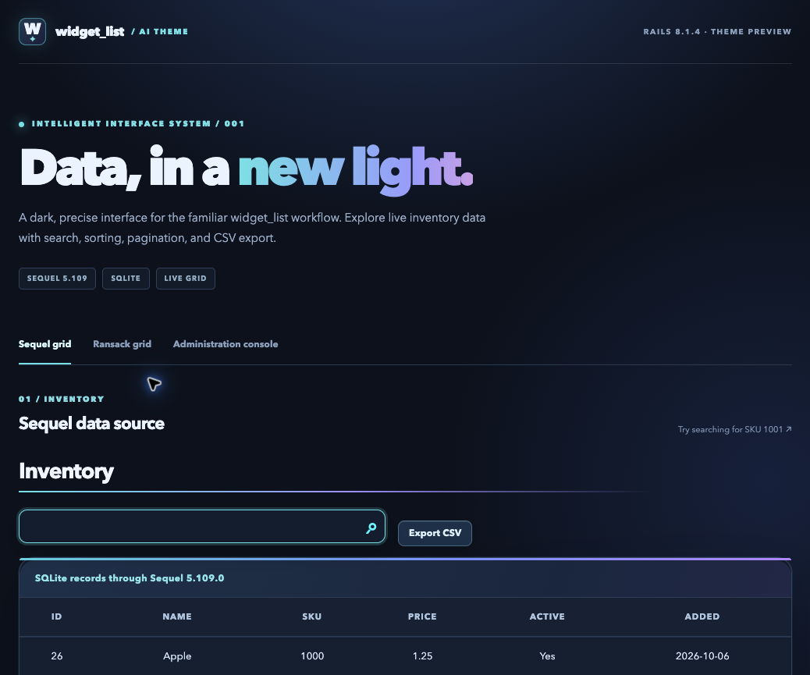

# widget_list_theme_ai

A dark, luminous theme for [widget_list](https://github.com/davidrenne/widget_list). It pairs midnight navy surfaces with cyan and violet accents, strong table contrast, compact controls, and a clear system font stack. The stylesheet stays inside widget_list grids, so it does not restyle the rest of a Rails app. No remote fonts, images, or JavaScript are required.



_The grid uses this gem; the surrounding page shell is part of the Rails 8 example app._

Version **0.1.0 is published on [RubyGems](https://rubygems.org/gems/widget_list_theme_ai)**. The theme targets widget_list 2.0.1 or newer on Rails 8 with Sprockets.

## Install

Add these gems to your Rails app's Gemfile:

```ruby
gem 'sprockets-rails'
gem 'jquery-rails'
gem 'widget_list', '~> 2.0', '>= 2.0.1'
gem 'widget_list_theme_ai', '0.1.0'
```

Then run `bundle install`. Add the theme stylesheet to `app/assets/config/manifest.js`:

```javascript
//= link widget_list_theme_ai.css
```

Load it **after** widget_list's styles in your layout:

```erb
<%= stylesheet_link_tag 'application', 'widget_list', 'widgets', 'widget_list_theme_ai' %>
```

The theme automatically supplies widget_list defaults when Bundler requires the gem. Existing lists need no controller changes. Per-list options passed to `WidgetList.go!` still take precedence. Run `bin/rails assets:precompile` before deploying. The base gem's [Rails 8 setup guide](https://github.com/davidrenne/widget_list#add-it-to-a-rails-8-app) explains the required JavaScript and database setup.

## Try it in the Rails 8 example

The [Rails 8 example](https://github.com/davidrenne/widget_list_example_rails8) demonstrates Sequel and Ransack lists plus the administration console. To see those lists with this theme, add `gem 'widget_list_theme_ai', '0.1.0'` to the example's Gemfile and follow the asset setup above. Then run `bundle install`, `bin/rails db:prepare`, `bin/rails db:seed`, and `bin/rails server`.

## Design choices

- Theme defaults provide colors, alternating rows, typography, and table settings through widget_list's existing `WidgetListThemeHelper::ThemeDefaults` hook.
- The CSS refines search, export, headers, rows, hover states, and pagination. It is scoped to `.widget_list_outer` and the theme's `.wl-ai` class.
- Focus rings remain visible, and motion is removed when the operating system requests reduced motion.
- The example app adds its own hero and page shell. Those styles are not part of this gem.

If your application provides its own `WidgetListThemeHelper::ThemeDefaults`, keep one theme provider loaded at a time or merge the desired settings into your own defaults class.

## License

MIT. See [LICENSE.txt](LICENSE.txt).
